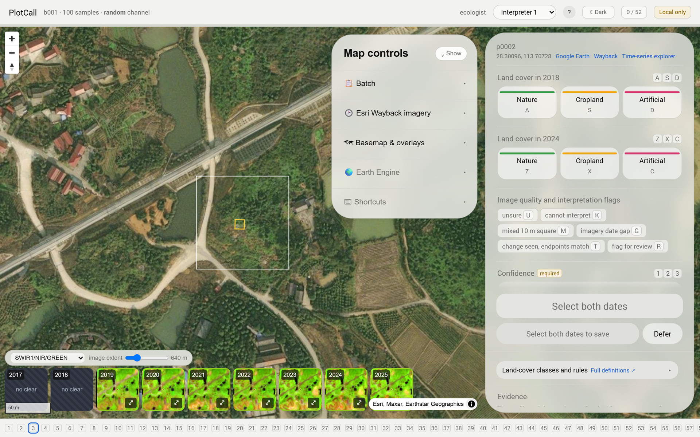
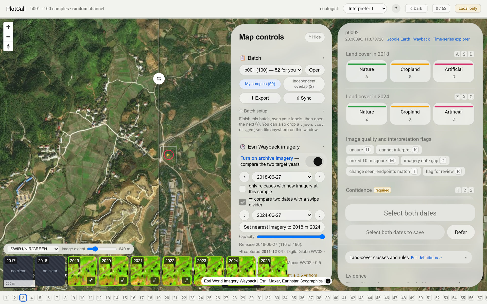
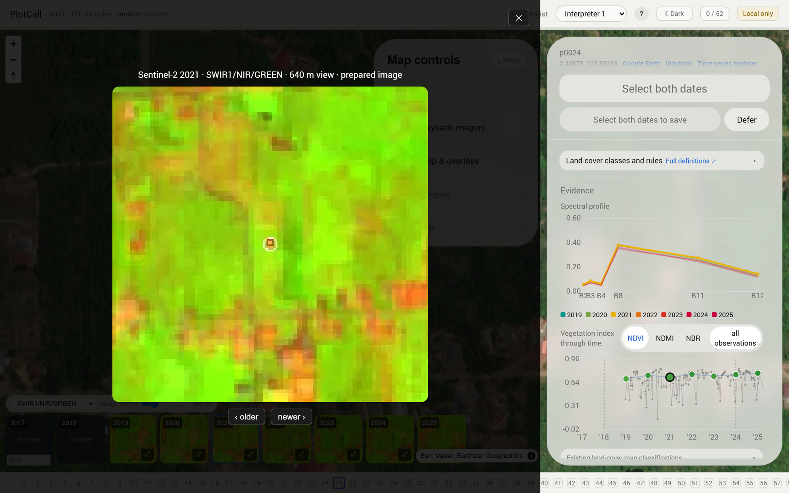
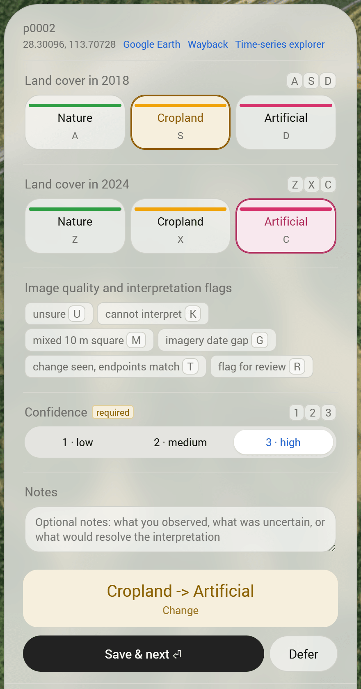
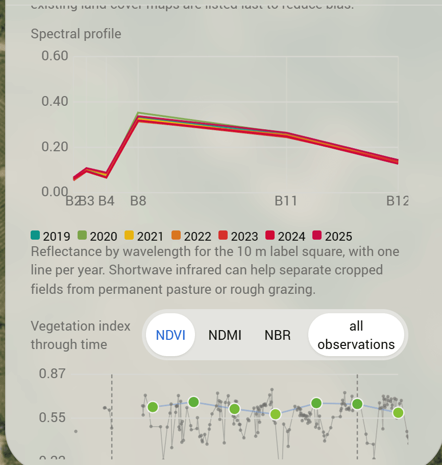
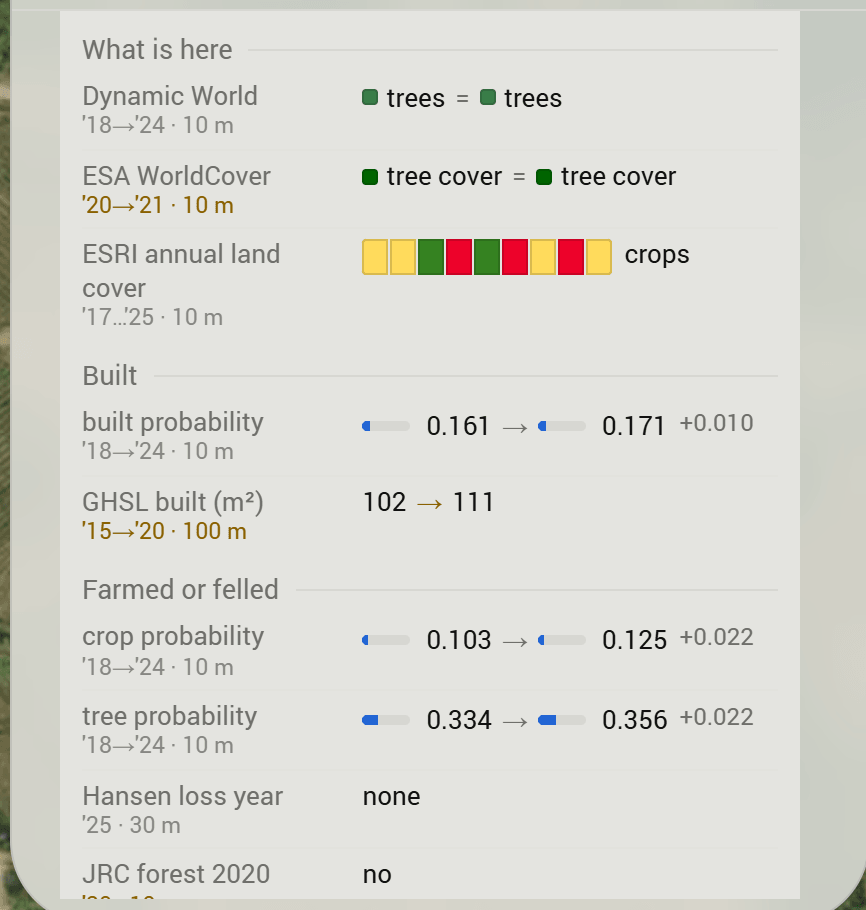
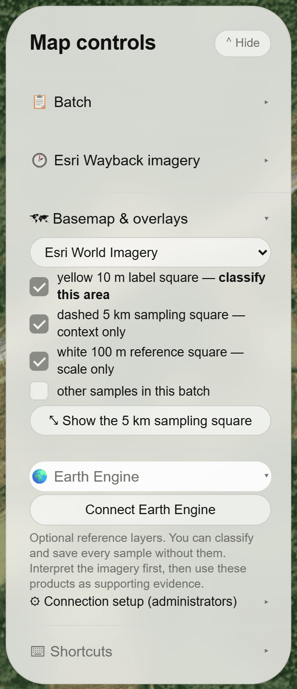
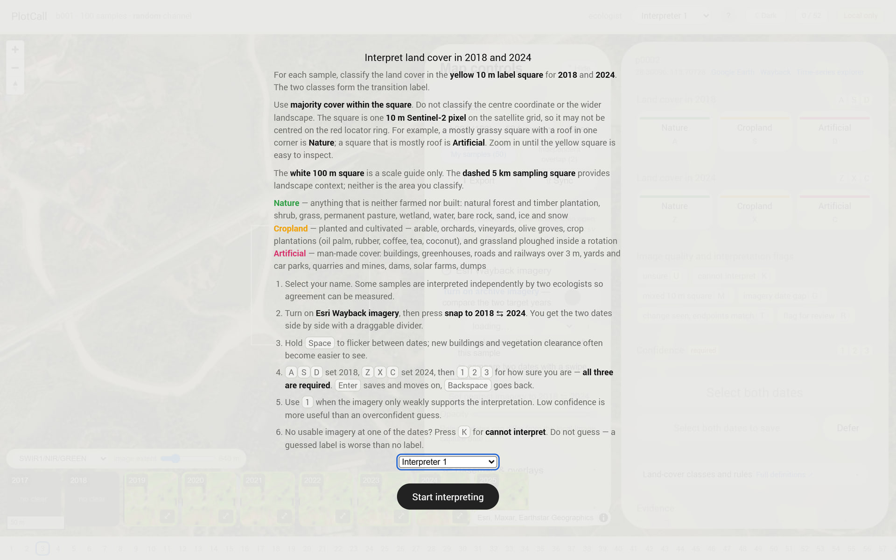

# PlotCall

PlotCall is a browser application for independent visual interpretation of land cover at a fixed Sentinel-2 cell. The included protocol asks a reader to classify the same 10 m cell in 2018 and 2024, producing an endpoint-to-endpoint transition label.

The repository contains the static application, batch builders, optional evidence builders, a Google Sheets backend, and tools for summarising completed rounds.

## Why use it

PlotCall makes several parts of a visual-interpretation protocol explicit:

- **Spatial support:** the yellow polygon is the exact Sentinel-2 grid cell being classified. Wider map guides provide context but are not the labelled unit.
- **Independent interpretation:** the model value under assessment is hidden until after the initial call. This reduces anchoring.
- **Consistent evidence:** both endpoint years use the same display controls, and optional time-series and auxiliary products are presented as supporting evidence rather than ground truth.
- **Traceable decisions:** exports include the two class calls, transition, confidence, flags, notes, reader, batch and timestamp.
- **Agreement sampling:** batches can assign some points to more than one reader, allowing inter-reader agreement to be estimated.
- **Recoverable work:** labels are saved locally, queued when submission fails, and can be exported and restored.

These features improve consistency and auditability. They do not make visual labels error-free or turn agreement into accuracy.

## What it looks like



The interpretation view. The **yellow square** is the Sentinel-2 cell being classified; the white square is a 100 m scale guide, and a dashed 5 km square gives landscape context. Neither is the labelled unit. The strip along the bottom is one clear Sentinel-2 image per year for that cell, and the panel on the right carries the two class calls.

| | |
| --- | --- |
| [](docs/screenshots/archive-swipe.jpg) | [](docs/screenshots/filmstrip-lightbox.jpg) |
| **The two endpoint years, side by side.** Archive imagery is stepped by release date, snapped to the two target years, and compared under a draggable divider. | **One clear image per year.** Any year can be enlarged and stepped through; the strip and its display stretch are baked into the batch, so it loads without Earth Engine. |
| [](docs/screenshots/call-panel.png) | [](docs/screenshots/evidence-charts.png) |
| **The call.** Two independent class calls, image-quality and interpretation flags, a required confidence, free-text notes, and the transition the app derives from the two years. | **Sentinel-2 measurements for the cell.** Reflectance by wavelength, one line per year, and NDVI, NDMI or NBR through time, with every clear observation optionally plotted behind the annual points. |
| [](docs/screenshots/auxiliary-maps.png) | [](docs/screenshots/map-controls.png) |
| **Existing maps, last and folded away.** Other classifications are supporting evidence, not ground truth, so they sit below the imagery, and each row states the years it actually covers. | **Map controls.** Basemap choice, the three drawn guides, optional Earth Engine reference layers, and the batch, export and sync controls. |



The brief opens the session and states the unit, the legend and the keys. Calibration batches with agreed reference interpretations run before real labelling.

Screenshots show a labelling round with baked evidence. The bundled demo batch is smaller and has no baked sidecars, so its filmstrip and charts fall back to live Earth Engine.

## Try it locally

PlotCall requires Python 3.11 or newer for the batch tools.

```bash
git clone https://github.com/Geethen/PlotCall.git
cd PlotCall
python -m pip install -e .
python src/build_label_batches.py --placeholder
python -m http.server 8000 --directory app
```

Open <http://localhost:8000/label_app.html>, choose an interpreter and open the demo batch.

The bundled demo is intentionally unconfigured:

- labels stay in the browser until exported;
- no Google Sheet receives data;
- live Earth Engine layers require authentication unless evidence has been baked;
- the demo points are examples, not a scientific sample.

Do not evaluate a protocol or model from the demo labels.

## Scientific workflow

1. Define the target population, sampling design, class legend and interpretation protocol.
2. Prepare a candidate table and create finite batches.
3. Assign readers and a deliberate overlap fraction.
4. Add optional evidence using documented dataset versions and processing parameters.
5. Run calibration batches with agreed reference interpretations.
6. Collect labels, preserving the initial independent call.
7. Estimate completion, disagreement and yield by acquisition channel.
8. Resolve or model disagreement according to a protocol specified before analysis.

PlotCall supports this workflow; it does not choose the sampling design or adjudication rule.

## Build batches

The candidate file must contain longitude and latitude columns. Common optional fields include `id`, `channel`, `rank`, `score`, `cell_km`, `primary_expert` and `required_readers`.

```bash
python src/build_label_batches.py \
  --candidates candidates.csv \
  --channel coverage \
  --batch-size 100 \
  --experts e1,e2 \
  --double-frac 0.05 \
  --campaign example
```

This writes batch JSON files and `app/batches/index.json`. Use `--exclude-labelled labels.csv` when constructing a later round so already interpreted points are not sampled again.

Available acquisition-channel labels are `coverage`, `uncertainty`, `retrieval` and `random`. They describe how a point was selected; the builder does not implement those sampling algorithms.

For calibration, provide points with an agreed transition column:

```bash
python src/build_label_batches.py \
  --candidates calibration.csv \
  --calibration \
  --reference-col transition \
  --stage teach \
  --feedback immediate
```

A qualification batch can instead use `--stage qualify --feedback end`.

## Optional baked evidence

Static evidence avoids repeated remote computation and lets the main interpretation workflow continue without Earth Engine. Install the optional dependencies first:

```bash
python -m pip install -e ".[bake]"
earthengine authenticate
```

Then build the desired products:

```bash
python src/build_batch_evidence.py --batch app/batches/b001.json
python src/build_batch_chips.py --batch app/batches/b001.json
python src/build_batch_dense.py --batch app/batches/b001.json
```

The builders update the batch and create sidecar files where required. Commit both together. Their recipes, dataset identifiers, date ranges and versions are part of the scientific provenance and should be recorded for each deployment.

## Configure a deployment

Edit `app/config.js`. All fields are optional; with `sheetUrl` empty, PlotCall operates locally and requires manual export.

The main settings are:

| Field | Purpose |
| --- | --- |
| `sheetUrl` | Google Apps Script `/exec` endpoint for submission and retrieval |
| `submitToken` | Browser-visible anti-spam value; it is not authentication |
| `experts` | Stable reader IDs and display names |
| `campaign` | Namespace included in label keys and exports |
| `manifest` | Batch-manifest path |
| `eeAuthMode` | `auto`, `service`, `oauth` or `off` |
| `eeTokenUrl` | Optional separate Earth Engine token broker |
| `eeProject` / `eeClientId` | Settings for the OAuth fallback |
| `cribsheetUrl` | Full protocol or legend definitions |

The GitHub Pages workflow uses the committed `app/config.js` by default. If the repository secret `LABEL_APP_CONFIG_JS` is set, its complete contents replace that file during deployment.

`sheetUrl`, `submitToken`, project IDs and OAuth client IDs are visible to every browser and must not be treated as secrets. Never put an Earth Engine service-account private key in browser code or repository configuration.

To use the supplied Sheets backend:

1. Create a Google Sheet.
2. Open **Extensions → Apps Script**.
3. Copy `app/apps_script/Code.gs`.
4. Set the script properties described at the top of that file.
5. Deploy it as a web application and place its `/exec` URL in `app/config.js`.
6. Verify `<sheetUrl>?action=ping` before a labelling session.

## Output and round reports

The natural record key is:

```text
(campaign, batch_id, point_id, expert_id)
```

Important exported fields include `class_2018`, `class_2024`, `transition`, `confidence`, interpretation flags, imagery flags, notes and `labelled_at`.

Download labels from the backend or combine local exports:

```bash
python src/label_rounds.py --url "YOUR_APPS_SCRIPT_EXEC_URL" --campaign example
python src/label_rounds.py --csv exports/*.csv --campaign example
```

The report describes returned calls, exclusions, disagreement and observed change yield. If a decision threshold is part of the design, supply it explicitly with `--binding`. An observed yield is conditional on the sample and interpretation process; it is not a population prevalence estimate unless the sampling design supports that inference.

## Default interpretation protocol

The included example uses three broad classes:

- **Nature:** cover that is neither cultivated nor built, including forest, shrub, permanent grassland, wetland, water and bare ground.
- **Cropland:** planted or cultivated cover, including arable land, orchards and crop plantations.
- **Artificial:** built or engineered cover, including buildings, transport surfaces, quarries and mines.

The reader assigns the majority class within the yellow 10 m cell for both endpoint years. The app derives the transition from those two calls.

This legend is implemented in `app/label_app.html`, not `app/config.js`. If you change it, update the class keys, keyboard shortcuts, hints, full cribsheet, calibration data, downstream schemas and tests together. The endpoint years are also part of the current implementation and must be changed consistently in the app and evidence builders.

## Interpretation limits

- A visual interpretation is an observation with uncertainty, not ground truth.
- Low confidence and “cannot interpret” have different meanings and should remain distinct.
- Agreement measures consistency between readers, not correctness.
- Auxiliary maps may share training data or correlated errors with the model being assessed.
- Archive imagery may not match the nominal endpoint date; record substantial date gaps.
- A 10 m cell can contain mixed cover, registration error or a boundary.
- Yield from uncertainty or retrieval samples cannot be read as area prevalence without appropriate inclusion probabilities or weighting.
- Changes to imagery sources, compositing, stretch, legend or evidence order can change the measurement process.

Preserve the deployed app version, batch files, evidence metadata and written protocol with the resulting labels.

## Tests

```bash
python -m pytest
```

Browser tests use Playwright. Install its browser runtime when required:

```bash
python -m playwright install chromium
```

## Repository layout

```text
app/
  label_app.html          static interpretation application
  config.js               deployment configuration
  batches/                manifest, batches and optional evidence sidecars
  apps_script/Code.gs     optional Google Sheets and token backend
src/
  build_label_batches.py  candidate table to finite batches
  build_batch_evidence.py summary evidence builder
  build_batch_chips.py    Sentinel-2 filmstrip builder
  build_batch_dense.py    dense spectral-series builder
  label_cell.py           Sentinel-2 cell geometry
  label_rounds.py         label collection and round summaries
tests/                    unit and browser tests
```

## License and attribution

Code is released under the MIT License. Imagery and derived products retain the terms and attribution requirements of their source datasets. The interface includes source attribution for the default map and evidence layers.
