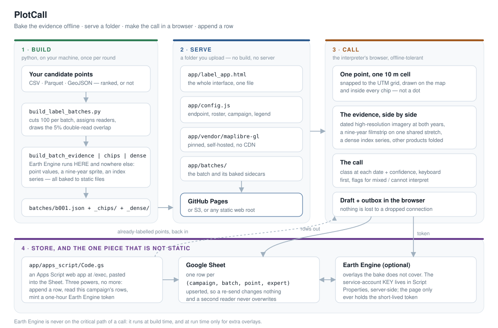

<p align="center">
  
</p>

<h1 align="center">PlotCall</h1>

<p align="center">
  <strong>One point. One pixel. One call.</strong><br>
  A single-file web app for photo-interpreting land cover at a point — with the
  evidence baked ahead of time, two or more interpreters, and the answers
  landing in a spreadsheet you can train on.
</p>

<p align="center">
  <a href="https://github.com/Geethen/PlotCall/actions/workflows/tests.yml"></a>
  
  
  
</p>

---

PlotCall was built to label land-cover **change between two dates** over Norway,
and kept campaign-neutral on purpose. The legend, the dates, the evidence panel
and the backend are all yours to set. There is no build step, no database and no
server: you edit one config file and upload a folder.

**Contents** — [Try it](#try-it-in-five-minutes) ·
[What an interpreter sees](#what-an-interpreter-sees) ·
[What comes back](#what-comes-back) ·
[How it fits together](#how-it-fits-together) ·
[Deploy for your study](#deploying-it-for-your-own-study) ·
[Adapting it](#adapting-it-to-a-different-campaign) ·
[Design decisions](#design-decisions-that-are-not-taste) ·
[Not a fit if](#not-a-fit-if)

## Why this rather than a GIS project or a labelling platform

Three constraints shaped it, and they are probably yours too.

- **The interpreter is the bottleneck, not the software.** Everything a call
  needs is on one screen, reachable from the keyboard, and nobody waits on a
  cloud service before they can look. Imagery chips and time series are **baked
  to static files** ahead of time; a point costs one file fetch.
- **Nobody should have to sign in.** A labeller opens a URL and works — no
  account, no install, no Earth Engine login. An optional service account
  authenticates the *deployment* so that the *people* do not have to.
- **Losing work is unacceptable.** Calls are drafted in the browser, queued in
  an outbox, upserted server-side and exportable to CSV at any moment. Closing
  the tab, losing the connection and re-dropping yesterday's export all do the
  right thing — each of those was a bug once, and each has a test.

## Try it in five minutes

```bash
git clone https://github.com/Geethen/PlotCall.git
cd PlotCall
pip install pandas pyproj

python src/build_label_batches.py --placeholder   # writes app/batches/b001.json
python -m http.server 8000 --directory app
# open http://localhost:8000/
```

Labels stay in the browser and come out of the **export** button until you point
`app/config.js` at a backend. Opening the folder over `file://` does not work —
the page fetches its batch manifest and browsers block that.

The demo batch has no baked evidence, so the filmstrip falls back to live Earth
Engine and, with nobody signed in, to flat colour. That is the app telling you
the truth: **bake it, or accept the fallback.**

## What an interpreter sees

One point at a time, each one a single **10 m cell snapped to the UTM grid** —
not a dot, and not a circle whose size drifts with the zoom. Around it:

| | |
| --- | --- |
| **Dated high-resolution imagery** | Esri Wayback at each of your two dates, so "before" and "after" are two specific captures rather than "the basemap", plus EOX Sentinel-2 cloudless for the sensor the model actually uses |
| **A nine-year filmstrip** | one Sentinel-2 thumbnail per year, all nine sharing **one measured stretch**, so a colour change means a ground change and not the atmosphere |
| **A dense index series** | NDVI / NDMI / NBR for the containing pixel, with the two called years marked |
| **Third-party products** | ESRI and Dynamic World land cover, Hansen loss, GHSL built surface — folded away at the foot, deliberately, so somebody else's confident classification is not the first thing read |
| **The call** | a class at each date, a **required** 1/2/3 confidence, and flags for *mixed*, *cannot interpret*, *imagery date gap* and *transient change* |

Keyboard throughout. Progress, assignment and second-reading state come out of
the batch file, so they stay correct with the network down.

A point is addressable: `?point=…&scheme=…&w=…` opens a colleague on the same
point under the same stretch. `?expert=e1` is a per-person bookmark.

## What comes back

One row per `(campaign, batch_id, point_id, expert_id)`, upserted, in a Google
Sheet you can read with `pandas.read_csv` or with `src/label_rounds.py`:

| column | |
| --- | --- |
| `class_2018`, `class_2024`, `transition`, `is_change` | the call |
| `confidence` | 1/2/3, required before a real call saves |
| `flags`, `uninterpretable_reason` | why a row should be treated carefully, or dropped |
| `expert_id`, `labeller` | a roster id, not typed text — see [the roster note](#your-appconfigjs) |
| `seconds_on_point` | how long the call took, which is how you find the hard classes |
| `imagery_a`, `imagery_b` | which Wayback captures were actually on screen |
| `channel`, `rank`, `score` | where the point came from, if you rank candidates |
| `lon`, `lat`, `labelled_at`, `app_version`, `received_at` | provenance |

The 5% of points that two people both call give you an inter-rater agreement
number — the only honest handle on the label noise that caps whatever you train.

## How it fits together



### 1 · Build — your points become a batch

```bash
python src/build_label_batches.py \
    --candidates my_points.csv \
    --campaign my-campaign --batch-size 100 --experts e1,e2
```

Input is any table with `id`, `lon`, `lat` (CSV, Parquet or GeoJSON). Everything
else on the row is carried through and shown in the *about this location* panel.
The builder cuts the table into batches **in the order you gave it**, assigns
each point a primary reader round-robin, and draws the overlap sample. Ranking
is your business; this script never re-orders.

Then bake the evidence — the only part that needs Earth Engine:

```bash
pip install earthengine-api pillow
earthengine authenticate

B=app/batches/b001.json
python src/build_batch_evidence.py --batch $B   # point values + annual timeline
python src/build_batch_chips.py    --batch $B   # the nine-year sprite, ~3 MB
python src/build_batch_dense.py    --batch $B   # the index series, ~10 KB/point
```

Budget roughly half an hour for a 100-point batch spread across the world: Earth
Engine rate-limits `getInfo`, and points far apart cannot share a request. A
batch clustered in one study area is much faster.

### 2 · Serve — `app/` is the whole website

```
app/
  index.html          redirect, so the site root works
  label_app.html      the entire interface, one file
  config.js           your deployment — this is the file you edit
  vendor/             MapLibre, pinned and self-hosted
  batches/            batch JSON + baked sidecars
  apps_script/Code.gs paste into your Sheet's Apps Script editor
```

Push to GitHub and `.github/workflows/pages.yml` publishes it, after checking
that the config parses and that the bakes are the version the app reads. Enable
it once under **Settings ▸ Pages ▸ Source: GitHub Actions** — until you do, the
deploy job fails with *Get Pages site failed*, which is the setting and not the
workflow. Or drag the folder onto any static host. There is no build.

### 3 · Call — the browser

The app reads `batches/index.json`, loads a batch, and works out of local
storage from then on. Each saved call is queued and flushed; the sheet is also
*read* on open, so a second machine — or a colleague already part-way through —
shows up instead of being silently duplicated.

A second reader is told **that** a point is taken and never **what** was said.
Showing the first reading would turn the agreement measurement into a
confirmation measurement.

### 4 · Store — a Google Sheet, via Apps Script

The only non-static piece, and it is one file pasted into the Sheet. It appends
a row, reads back this campaign's rows, and optionally mints an Earth Engine
token. Rows are upserted on the four-part key, so re-sending a row that already
arrived changes nothing and a second reader never overwrites the first.

## Deploying it for your own study

Five steps, in order.

### The Sheet backend

1. Make a Google Sheet. **Extensions ▸ Apps Script**, and paste
   [app/apps_script/Code.gs](app/apps_script/Code.gs) over `Code.gs`.
2. **Project Settings ▸ Script Properties**, add `SUBMIT_TOKEN` with any random
   string. This is anti-spam, not authentication — it keeps junk rows out if
   somebody finds the URL, and it draws no line between your interpreters.
3. **Deploy ▸ New deployment ▸ Web app**, execute as *me*, access *anyone*.
   Copy the `/exec` URL.
4. Check it: `curl '<exec-url>?action=ping'` should answer with JSON.

### Your `app/config.js`

```js
window.LABEL_APP_CONFIG = {
  sheetUrl:    'https://script.google.com/macros/s/…/exec',
  submitToken: '…the same string…',
  campaign:    'my-campaign',
  title:       'My study · interpretation',
  heading:     'My study',
  experts: [
    { id: 'e1', name: 'Ada' },
    { id: 'e2', name: 'Grace' }
  ],
  eeAuthMode: 'auto',
  pointZoom: 15
};
```

**The roster is not decoration.** `expert_id` is a field of the annotation key,
and it comes from this list. Let people type their own name instead and "Ann",
"ann" and "Ann " are three interpreters to a `groupby`: the agreement number
then reads a clean 100% over nothing at all, and you find out months later.

**On committing these values.** Neither `sheetUrl` nor `submitToken` is a
secret, and neither can be — the browser downloads this file, so anyone who can
open the app already has both. Commit them if the repository is yours. What must
*never* be committed is the Earth Engine **service-account private key**; the
whole reason the token broker exists is that a browser may not hold one. If your
repository is shared with people who should not see the backend, put the whole
file in the `LABEL_APP_CONFIG_JS` Actions secret and the Pages workflow injects
it at build time.

`.githooks/pre-commit` refuses a commit containing a private key. Enable it once
per clone with `git config core.hooksPath .githooks`.

### The legend is yours

`CLASSES` near the top of the script block in
[app/label_app.html](app/label_app.html) is the whole legend: a key, two shortcut
keys, a CSS class and the one-line hint the interpreter reads. Change it, change
the matching colours below it, and point `cribsheetUrl` at your own full class
definitions.

Two things not to get wrong:

- **Say what the labelling unit is, and draw it.** Here it is *majority cover of
  one 10 m Sentinel-2 pixel*, snapped to the UTM grid by
  [src/label_cell.py](src/label_cell.py) and drawn identically in the app —
  the two are checked against each other in CI by running the app's JavaScript
  in node against the Python. If your model consumes a different grid, move both
  together. A brief that says one thing while the map draws another produces
  labels for a footprint nobody judged.
- **Never teach two legends.** If `cribsheetUrl` and the in-app hints drift
  apart, different people label to different standards, and the round report is
  where you find out.

### Calibrate before anybody labels anything

Two stages, in this order, from points whose answer you already agree on:

```bash
python src/build_label_batches.py --candidates agreed.csv \
    --calibration --stage teach   --reference-col transition --prefix cal
python src/build_label_batches.py --candidates agreed.csv \
    --calibration --stage qualify --reference-col transition --prefix qual
```

`teach` tells the interpreter the answer after every call; `qualify` is blind and
tells them once at the end. One mixed set does neither job: being told the
answer is what makes the legend stick, and being told the answer is also what
makes the score meaningless.

Read the **confusion pairs**, not the headline percentage. One person
consistently calling long fallow *Cropland* is a briefing you can fix in ten
minutes, and it looks nothing like the same number made of scattered singletons.

### Close the round

```bash
# rows back out of the Sheet, with a report of what the round bought
python src/label_rounds.py --url '<exec-url>' --campaign my-campaign

# cut the next round without repeating any of it
python src/build_label_batches.py --candidates next.csv \
    --exclude-labelled data/analysis_results/label_rounds.csv
```

## Adapting it to a different campaign

| what | where | how hard |
| --- | --- | --- |
| Name, roster, campaign, backend | `app/config.js` | a text edit |
| Classes, hints, shortcut keys, colours | `CLASSES` in `label_app.html` | a text edit |
| Batch size, overlap fraction, assignment | flags on `build_label_batches.py` | a flag |
| Labelling unit / grid | `src/label_cell.py` **and** `s2Cell()` in the app | two functions, one test holds them together |
| **The two dates** | ~80 places across the app and the builders | a deliberate find-and-replace: the years are baked into column names (`class_2018`), evidence keys and layer definitions |
| Evidence rows in the panel | `build_batch_evidence.py` | add a dataset, bump `EVIDENCE_VERSION`, re-bake |
| Basemaps | `BASES` in `label_app.html` | a MapLibre source each |

The dates being the expensive one is honest rather than ideal. Everything else
was designed to move; the endpoints were not, because every evidence layer is
chosen to *end* at one of them.

## Earth Engine, optionally

The app runs with Earth Engine switched off entirely (`eeAuthMode: 'off'`) — the
baked chips and series carry it. Turn it on for extra overlays and there are two
ways:

- **`'service'` / `'auto'` (recommended).** Put a service-account key in the
  Apps Script's Script Properties as `EE_SERVICE_ACCOUNT_KEY`. The script mints
  a one-hour read-only token per browser and nobody signs in. The account needs
  `earthengine.computations.create` **and** `earthengine.maps.create` — the
  stock *viewer* role grants the first and not the second, and the gap shows up
  only when a tile is requested, never when the token is minted.
- **`'oauth'`.** Everyone signs in with their own Google account and you register
  every serving origin on an OAuth **Web** client. An unregistered origin fails
  *silently*: Google prints `origin_mismatch` inside the popup, the SDK sets no
  error callback, and it reads exactly like a blocked pop-up.

Either way, `getMapId` validates the *request*, not the result — a bad band name
or an empty collection mints cleanly and fails per tile. The app surfaces that
rather than logging it to a console nobody has open.

## Design decisions that are not taste

Four choices that look arbitrary, are not, and cost something to relitigate.

1. **Batches are small and sequential.** 100 points, and no schedule parameter.
   The same budget delivered as one batch and as twenty is not the same
   experiment: refitting between batches is the entire value of a
   model-in-the-loop campaign, and a one-shot run throws that half away.
2. **The overlap sample lives in the batch file**, not in a checkbox. When it
   was a checkbox, forgetting it one way produced duplicated work and forgetting
   it the other way produced zero overlap — and neither is visible until the
   round report.
3. **Evidence is baked at build time.** Static hosting is the point, and the
   loop has to work with Earth Engine never signed in. Only the fallback is live.
4. **Somebody else's land-cover product is folded away.** The labels are
   training data for your model; twenty rows of a confident classification at the
   top of the panel is an anchor, not evidence.

[app/README.md](app/README.md) is the long version — every one of these has a
measurement behind it.

## Repository layout

| | |
| --- | --- |
| [app/](app/) | the deployable folder — and [app/README.md](app/README.md), the operator's manual, much longer than this page and worth reading before a real campaign |
| [src/](src/) | the builders: batches, evidence, chips, dense series, round pull-back |
| [tests/](tests/) | regression tests, each pinned to a bug that silently lost or blocked work |
| [docs/](docs/) | the architecture diagram and the icon |
| [demo/](demo/) | 24 points, so `--placeholder` runs on a fresh clone |

## Tests

```bash
pip install pytest playwright pillow pandas pyproj
playwright install --with-deps chromium
pytest tests -q
```

They are not decoration. Each is a fault that reached production and was
invisible from a diff: an annotation key that dropped the second reader, a
`point_id` of `0012` coerced to `12`, an outbox that discarded a correction made
mid-flight, a chip bake stamped with a version three quarters of its pixels did
not have. Two of them run the app's own JavaScript in node against the Python
that has to agree with it — a Python double cannot police a contract the
JavaScript disagrees with.

Tests that need a baked batch skip cleanly on a fresh clone, and say which
builder to run.

## Not a fit if

- You need **polygons or segmentation masks.** This calls a point, on purpose.
- You need **hundreds of concurrent labellers.** A Google Sheet is the backend:
  excellent for a handful of experts, wrong for a crowd.
- Your evidence is **not imagery** — the whole panel assumes a map and a time
  series over a coordinate.
- You need **row-level access control.** The submit token is anti-spam. Anyone
  with the URL can write a row, and the design says so out loud rather than
  implying otherwise.

## Credits

[MapLibre GL JS](https://maplibre.org/), [Esri Wayback](https://livingatlas.arcgis.com/wayback/),
[EOX Sentinel-2 cloudless](https://s2maps.eu/), [Google Earth Engine](https://earthengine.google.com/)
and Google Apps Script. Built for a land-cover change mapping project and
released because the hard parts — the offline bake, the annotation key, the
outbox, the calibration stages — are the same in every campaign.

MIT licensed. Issues and forks welcome; if you adapt it to a different domain,
open an issue and say so.
